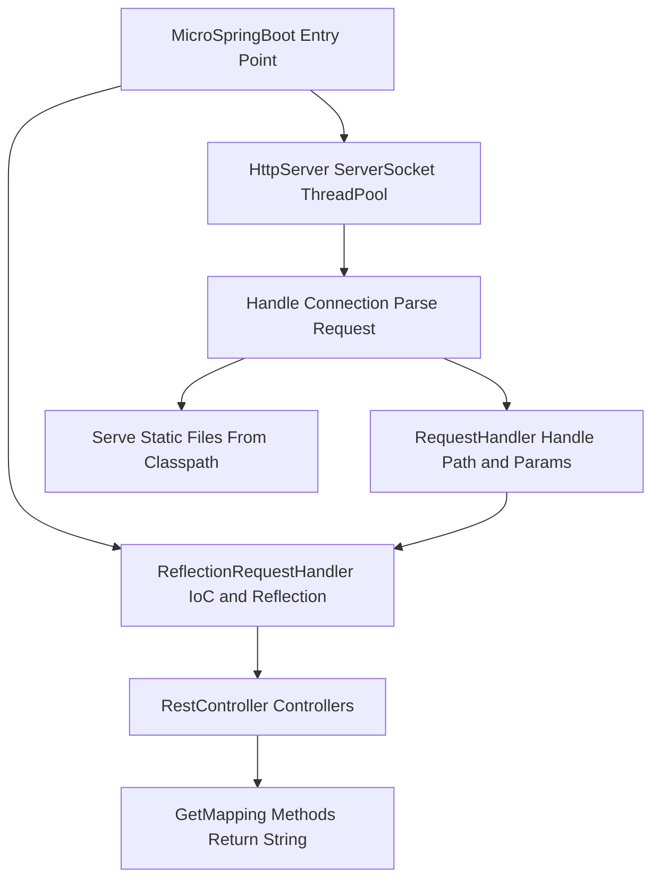
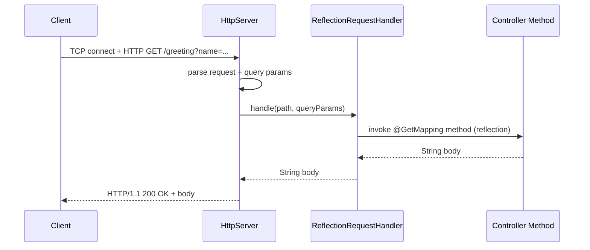
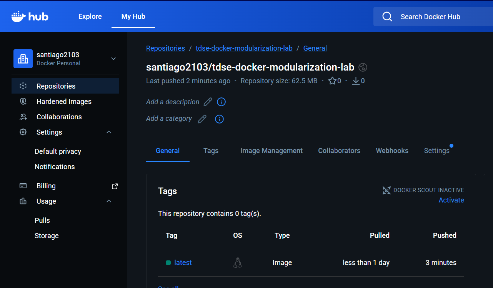
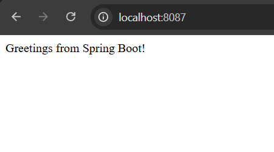
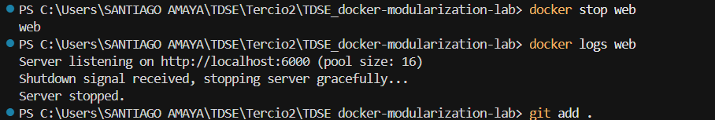

# MicroSpringBoot - Servidor web IoC con reflexión (Java)

Aplicación web basada en un framework propio (sin Spring) que ofrece un servidor HTTP con inyección de control vía reflexión, concurrencia y apagado elegante, pensada para desplegarse en AWS EC2 con Docker.

---

## Resumen del proyecto

- **MicroSpringBoot** es un servidor HTTP mínimo en Java que:
  - Expone rutas REST mediante anotaciones (`@RestController`, `@GetMapping`, `@RequestParam`).
  - Sirve archivos estáticos desde el classpath.
  - Atiende **múltiples peticiones en paralelo** mediante un pool de hilos.
  - Realiza un **apagado elegante**: deja de aceptar nuevas conexiones y espera a que las peticiones en curso terminen antes de cerrar (ideal para contenedores y SIGTERM).

El proyecto está preparado para compilar a `target/classes`, copiar dependencias a `target/dependency` (Maven Dependency Plugin), y construir una imagen Docker **sin compilar dentro del contenedor** (siguiendo el estilo de guía del curso).

---

## Arquitectura




- **Entrada**: `MicroSpringBoot` escanea o recibe por argumentos las clases con `@RestController`, las registra en `ReflectionRequestHandler` y arranca `HttpServer` en el puerto configurado.
- **Puerto configurable**: por defecto **35000**, o por variable de entorno `PORT` (útil en Docker/EC2).
- **Concurrencia**: cada conexión TCP aceptada se delega a un hilo del pool (tamaño por defecto 16). Varias peticiones se atienden al mismo tiempo.
- **Apagado elegante**: al recibir SIGTERM (p. ej. `docker stop`) o Ctrl+C, se ejecuta un shutdown hook que cierra el `ServerSocket`, hace `executor.shutdown()` y espera hasta 30 s a que terminen las tareas en curso antes de salir.

---

## Diseño de clases

| Componente | Responsabilidad |
|------------|------------------|
| **MicroSpringBoot** | Punto de entrada; carga controladores (por argumentos o escaneo de paquete) y arranca el servidor. |
| **HttpServer** | Abre el `ServerSocket`, acepta conexiones y las envía al `ExecutorService`; implementa `start()` y `stop()` para arranque y apagado elegante. |
| **RequestHandler** | Interfaz para resolver una ruta y parámetros y devolver el cuerpo de la respuesta (o `null` si no aplica). |
| **ReflectionRequestHandler** | Implementación que mantiene un mapa ruta → método; invoca por reflexión los métodos anotados con `@GetMapping` en instancias de `@RestController`. |
| **ClassPathScanner** | Busca en el classpath clases anotadas con una anotación dada (p. ej. `@RestController`). |
| **Controllers** | Clases anotadas con `@RestController` y métodos con `@GetMapping` y opcionalmente `@RequestParam`; devuelven `String` como cuerpo HTML. |

Flujo de una petición GET: `HttpServer` recibe la conexión en un hilo del pool → parsea método, path y query → llama a `RequestHandler.handle(path, queryParams)` → si devuelve valor, lo envía como 200 OK; si no, intenta servir recurso estático o devuelve 404.



---

## Cómo generar las imágenes Docker

### Requisitos

- JDK 11+
- Maven 3.x
- Docker

### Build (clases compiladas + dependencias copiadas)

```bash
mvn clean package
```

Esto genera:

- `target/classes` (clases compiladas)
- `target/dependency` (dependencias copiadas por `maven-dependency-plugin`)

### Construcción de la imagen Docker

En la raíz del repositorio (donde está el `Dockerfile`):

```bash
docker build -t microspringboot:latest .
```

Para publicar en un registro (ej. ECR o Docker Hub):

```bash
# Ejemplo con tag para ECR
docker tag microspringboot <account-id>/microspringboot:latest
docker push <account-id>/microspringboot:latest
```



### Ejecución del contenedor (prueba local)

```bash
docker run -p 8087:6000 microspringboot:latest
```



En el contenedor la aplicación escucha en `PORT=6000` (configurado en el `Dockerfile`). Para apagado elegante:

```bash
docker stop <container_id>
```

El servidor dejará de aceptar nuevas conexiones y esperará a que las peticiones en curso terminen antes de salir.



---

## Docker Compose (web + mongo)

En la raíz del proyecto:

```bash
docker compose up --build
```

- Web: `http://localhost:8087/`
- Mongo: expuesto en `localhost:27017` (contenedor `db`)


Para detener:

```bash
docker compose down
```

---

## Despliegue en AWS EC2

1. **EC2**: lanzar una instancia (Amazon Linux 2 o Ubuntu), abrir el puerto que uses (p. ej. 8087 o 80) en el security group.
2. **Docker en EC2**: instalar Docker en la instancia y, si aplica, configurar autenticación a ECR.
3. **Ejecutar**: `docker run -d -p 8087:6000 --name app microspringboot:latest` (o la imagen que hayas subido a ECR/DockerHub).
4. Probar con `http://<IP-pública-EC2>:8087/`.

*(Aquí puedes añadir capturas de pantalla de tu despliegue en EC2 y de las pruebas realizadas.)*

### Imágenes del despliegue

*(Incluir aquí capturas de:)*  
*- Navegador mostrando la aplicación en la URL de EC2.*  
*- Consola o logs del contenedor en la instancia.*  
*- Opcional: panel de EC2 o Docker en AWS.*

---

## Ejecución local (sin Docker)

```bash
mvn compile exec:java
```

O con el JAR:

```bash
java -jar target/reflexionlab-1.0-SNAPSHOT.jar
```

Para ejecutar con classpath manual (nota: en Windows el separador es `;`, en Linux/macOS es `:`):

```bash
java -cp "target/classes;target/dependency/*" co.edu.escuelaing.reflexionlab.MicroSpringBoot
```

---

## Licencia

Uso académico / proyecto TDSE.
